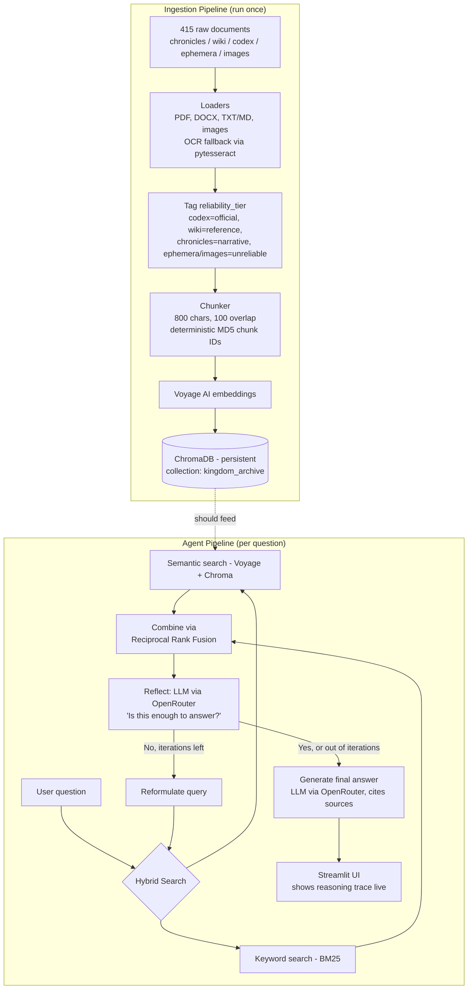

# Architecture

## Overview

The system has two pipelines: an **ingestion pipeline** (run once, ahead of time) that turns the
415-document Ashen Era Archive into searchable chunks, and an **agent pipeline** (run per
question) that searches, reflects on what it found, searches again if needed, and answers.

*(Written from the actual code — flag anything below that's changed since.)*

## Diagram

## Components

| Component | Tech | File(s) | Notes |
|---|---|---|---|
| Document loading | `pypdf`, `pdf2image`+`pytesseract` (OCR fallback), `python-docx` | `src/ingestion/loaders.py` | OCR triggers when extracted PDF text < 20 chars (likely a scanned page) |
| Chunking | Custom, 800 char / 100 overlap | `src/ingestion/chunker.py` | Chunk IDs are `md5(filename+page+chunk_index)` — deterministic, so re-runs skip already-embedded chunks |
| Embeddings | Voyage AI | `src/ingestion/embed_and_store.py` (`voyage-2`), `src/search/semantic_search.py` (`voyage-3`) | **Model mismatch between these two files — confirm with Person 1/2 which is intended, and note neither is in the voyage-4 family the competition's free-tier guidance recommends** |
| Vector store | ChromaDB | Ingestion: `PersistentClient` at `./data/chroma_db`, collection `kingdom_archive` | See "Current status" below — the search side isn't reading from this yet |
| Keyword search | BM25 (`rank_bm25`) | `src/search/keywordSearcher.py` | |
| Result fusion | Reciprocal Rank Fusion (k=60) | `src/search/hybrid_search.py` | |
| Reflection ("enough info?") | LLM via OpenRouter | `src/search/reflect.py` | Parses a `SUFFICIENT: yes/no` + `NEW_QUERY:` formatted response |
| LLM calls | OpenRouter (OpenAI-compatible API) | `src/search/LLM_client.py` | Fallback chain: `google/gemma-4-31b-it:free` → `openrouter/free` |
| Agent loop / state | Custom | `src/search/agent.py`, `src/search/state.py` | `max_iterations` currently defaults to **3** in code — confirm with Person 2 whether this matches the team's intended cap |
| UI | Streamlit | `src/ui/` | *(not yet reviewed — Person 3 to confirm what's built)* |

## Current status (be honest about this in the report)

As of today, `semantic_search.py` and `keywordSearcher.py` build their index from a small
hardcoded example dataset (`sample_data.py`), not from the real `kingdom_archive` collection
built by ingestion. Person 2 is actively connecting these. Once that's done, the diagram above
is accurate end-to-end; until then, the agent loop mechanics work, but on placeholder data. See
`docs/limitations.md` and `docs/decisions.md` for more.

## Open questions for the team (fill in and delete this section)

- [ ] Final `voyage-2` vs `voyage-3` decision — pick one, update both files
- [ ] Final `max_iterations` value — 3 or ~5?
- [ ] What does `src/ui/` actually look like — confirm with Person 3, add a line here
